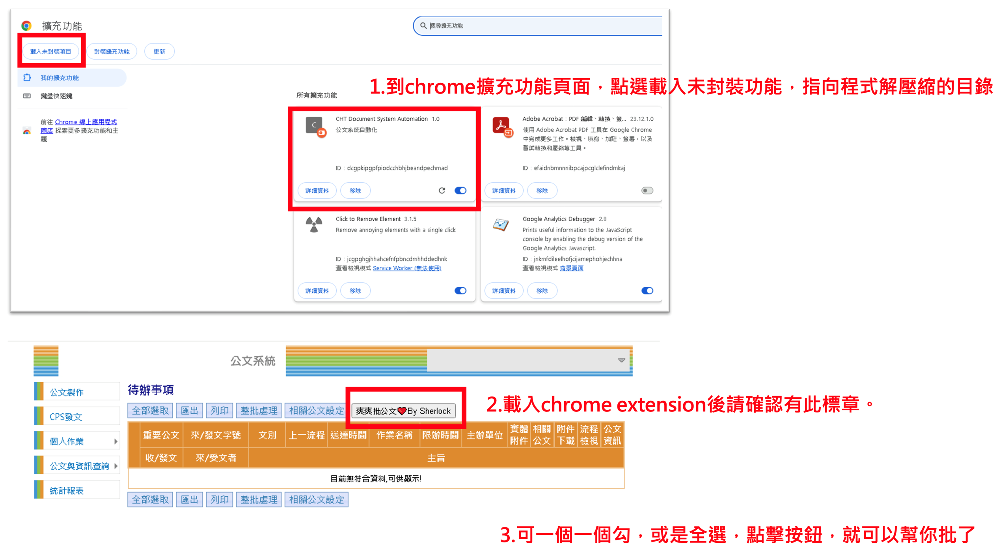

# 公文爽爽批
年底了，你是不是還一堆公文沒批?但通常也只是副知，ㄚ關我屁事~ 眼不見為淨，幫你大批簽核。
[註]原本的整批處理就真的是爛爆了，條件一大堆，沒有一次能成功。

1.將odocauto_chromeExtension 目錄下載到本地後，隨便你放哪。然後使用chrome 的擴展，如下圖說明，點選【載入未封裝項目】，就可以掛載到你的chrome。
2.切到公司的公文系統，若有成功載入外掛，會出現一個按鈕。便可確認已經掛上。
3.你可以一個一個勾，又或是用原本頁面上就有的全部選取，勾選後，按下爽爽批公文，就可無腦批核。畫面會重新載入，就可以繼續把公文弄掉。

